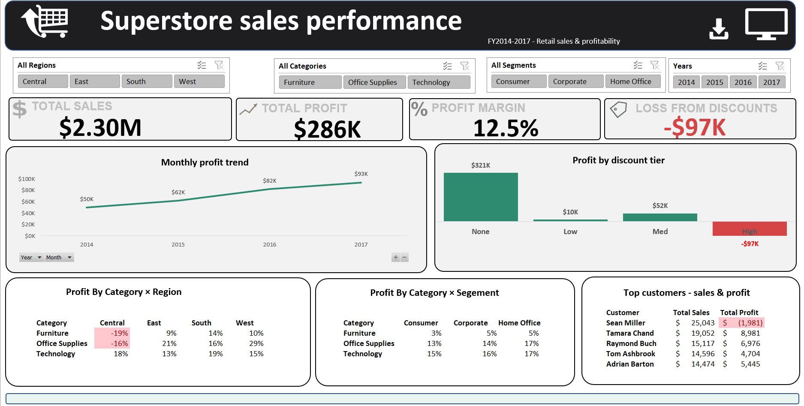

# 📊 Superstore Sales & Revenue Performance Dashboard

An end-to-end Excel analytics project that turns raw, unprocessed retail transaction data into an interactive sales dashboard — covering data cleaning, business calculations, pivot analysis, and data visualization, all built from scratch in Excel.

---

## 🎯 Project Objective

Retail businesses generate large volumes of transactional data, but raw data alone doesn't drive decisions — insight does. This project simulates a real analyst task: given unprocessed sales records, clean the data, identify data quality issues, calculate key business metrics, and build a dashboard that helps stakeholders answer:

- Which regions, categories, and segments drive the most revenue and profit?
- Where is heavy discounting eroding profitability?
- How does sales performance trend over time?
- Who are the top customers by value?

---

## 🗂️ Dataset

**Source:** [Sample Superstore Dataset — Kaggle](https://www.kaggle.com/datasets/vivek468/superstore-dataset-final)

| Detail | Value |
|---|---|
| Records | 9,994 transactions |
| Columns | 21 fields |
| Time span | January 2014 – December 2017 |
| Type | Real, anonymized US retail transaction data |
| License | Public dataset, free for educational/portfolio use |

Field-by-field definitions are in [`data_dictionary.md`](data_dictionary.md).

---

## 🧰 Tools Used

- **Microsoft Excel** — Power Query, PivotTables, PivotCharts, slicers, conditional formatting
- **Kaggle** — data source

---

## 📄 Documentation

This project's documentation is split into focused files so each part is easy to navigate:

| File | Contents |
|---|---|
| [`data_dictionary.md`](data_dictionary.md) | Definitions of every field in the raw dataset |
| [`data_quality_report.md`](data_quality_report.md) | Step 1 — full raw-data audit and every issue found |
| [`methodology.md`](methodology.md) | Step 2 & 3 — full cleaning and calculation workflow (what was done, and how) |
| [`analysis_findings.md`](analysis_findings.md) | Step 3 & 4 — actual results, tables, and insights, plus the dashboard |
| [`recommendations.md`](recommendations.md) | Business recommendations based on the findings |

--- 
### Dashboard Overview


The main dashboard brings the key metrics and analysis together in a single view.

### Interactive Dashboard


A filtered view of the dashboard showing how the analysis changes based on the selected month.

### Sales Analysis


The sales analysis focuses on trends, categories, products, customers, and years.

### Supporting Excel Analysis


The dashboard is supported by PivotTables and structured Excel analysis built from the underlying transaction data.

## 📁 Repository Structure

```
/superstore-sales-dashboard
├── data/
│   └── raw/
│       └── superstore_RAW.csv          # Original, untouched dataset
├── superstore_dashboard.xlsm           # Main Excel workbook (cleaning, analysis, dashboard)
├── README.md
├── data_dictionary.md
├── data_quality_report.md
├── methodology.md
├── analysis_findings.md
└── recommendations.md
```

---

## 🚀 How to Use

1. Clone or download this repository
2. Open `superstore_dashboard.xlsm` in Excel (Power Query, PivotTables, and Slicers are included — enable macros if prompted)
3. Review `data/raw/superstore_RAW.csv` to see the original, unmodified source data
4. Start with `data_quality_report.md` and `methodology.md` for the full process, then `analysis_findings.md` for results and the dashboard

---

## 👤 Author 
**Fatima Kassidi**
 
Built as part of a self-directed Data Analyst portfolio project.
